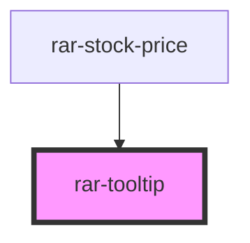

# rar-tooltip

<!-- Auto Generated Below -->

## Properties

| Property | Attribute | Description | Type      | Default     |
| -------- | --------- | ----------- | --------- | ----------- |
| `opened` | `opened`  |             | `boolean` | `false`     |
| `text`   | `text`    |             | `string`  | `undefined` |

## Dependencies

### Used by

 - [rar-stock-price](../rar-stock-price)

### Graph

----------------------------------------------

*Built with [StencilJS](https://stenciljs.com/)*
